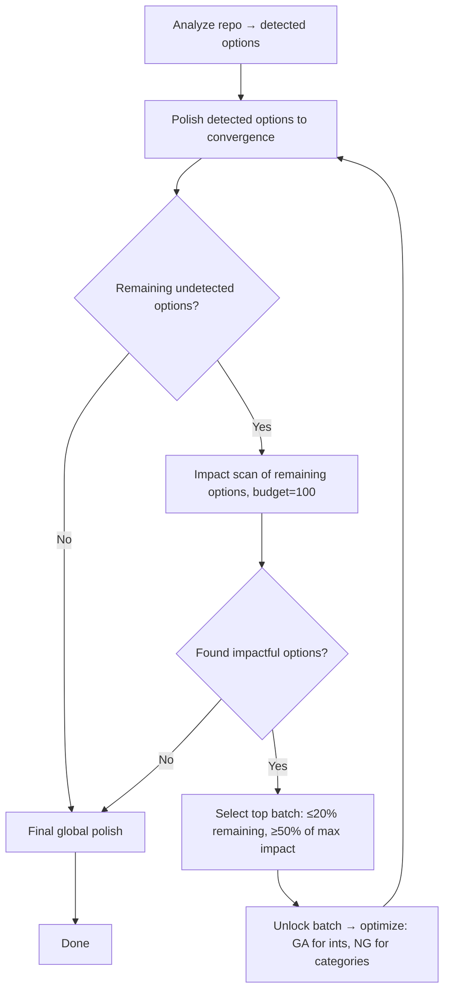

# Plan: Iterative Expansion Optimizer

Replace the static 3-tier phased optimizer with an iterative expansion loop that
empirically discovers impactful options between stages.

## Design

## Key Decisions

| Decision | Rationale |
|---|---|
| Batch size: ≤20% of remaining, with drop-off guardrail | Scales with repo size; guardrail prevents dragging in noise |
| Impact budget: 100 (default) | Enough to find signal in 100+ option space; convergence detection exits early |
| Stopping: no impactful options found or all exhausted | Low-impact options converge quickly; per-phase convergence is sufficient |
| Inter-stage: polish only new batch | Faster; final global polish handles interactions |
| GA for integers, nevergrad for categories | Already implemented in `_run_phase` |

## Implementation Beads

### cfa-c6s: Umbrella — Iterative expansion optimizer

#### cfa-c6s.1: Refactor `measure_impact` to score remaining (fixed) options
- Currently scores detected options and assigns tiers.
- New: accept a set of option names to score, run nevergrad over them, return impact scores (fitness delta per option).
- Output: ranked list of (option_name, impact_score) tuples.
- Strangler fig: keep existing `measure_impact` signature, add `measure_remaining_impact`.

#### cfa-c6s.2: Add `unlock` operation to `SearchSpace`
- Add `unlock(names: list[str]) -> None` method that changes fixed parameters to mutable.
- Add `remaining_fixed() -> list[ParameterDef]` to get options not yet unlocked.
- Strangler fig: additive only, no changes to existing methods.

#### cfa-c6s.3: Implement `run_iterative_optimization`
- New function in `src/optimization_engine/iterative.py`.
- Loop: polish detected → impact scan remaining → select batch → unlock → optimize → repeat.
- Use existing `_run_phase` for the optimize step (GA/nevergrad split already handled).
- Convergence: per-phase convergence detection (existing); stop expansion when impact scan finds nothing.
- Strangler fig: new module, no changes to `phased.py`.

#### cfa-c6s.4: Wire iterative optimizer into CLI
- Add `--optimizer iterative` option.
- Default impact budget to 100 (change from 30).
- Keep `--optimizer phased` working (backward compatible).
- Strangler fig: new CLI branch, no changes to existing optimizer paths.

#### cfa-c6s.5: Integration tests for iterative pipeline
- Test full loop: analyze → polish → expand → optimize → repeat.
- Test stopping conditions: no impactful options, all exhausted.
- Test batch selection: percentage cap, drop-off guardrail.
- Strangler fig: new test file `tests/test_iterative.py`.

## Migration

- `phased` optimizer remains available as `--optimizer phased`.
- `iterative` becomes the recommended default once stable.
- No breaking changes to existing CLI or API.

## Files Affected

| File | Change |
|---|---|
| `src/analyze_conventions/impact.py` | Add `measure_remaining_impact` |
| `src/optimization_engine/types.py` | Add `unlock`, `remaining_fixed` to `SearchSpace` |
| `src/optimization_engine/iterative.py` | New: iterative expansion loop |
| `src/optimization_engine/__init__.py` | Export new module |
| `main.py` | Wire `--optimizer iterative`, default impact budget |
| `tests/test_iterative.py` | New: integration tests |
| `tests/test_clang_format_adapter.py` | Tests for `unlock`, `remaining_fixed` |
| `tests/test_analyze/test_impact.py` | Tests for `measure_remaining_impact` |
